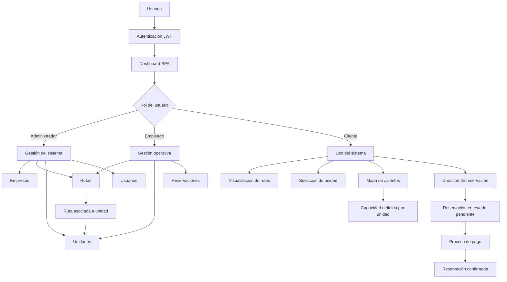

## Sistema de Transporte (FastAPI + Frontend)
Este proyecto consiste en un sistema de gestión de transporte desarrollado con FastAPI en el backend y un frontend implementado en JavaScript puro. El sistema permite la administración de empresas de transporte, rutas, unidades, reservaciones y pagos, con control de acceso basado en roles.

## Arquitectura del sistema
El sistema está estructurado en tres capas principales:
El backend está desarrollado con FastAPI y expone una API REST encargada de gestionar toda la lógica del sistema. Incluye autenticación mediante JWT y control de acceso basado en roles (administrador, empleado y cliente). La interacción con la base de datos se realiza mediante SQLAlchemy como ORM.
La base de datos contiene las entidades principales del sistema: usuarios, empresas, rutas, unidades, reservaciones y pagos, las cuales se relacionan entre sí para modelar el flujo completo de transporte y reservación.
El frontend está desarrollado en JavaScript puro, donde las vistas se renderizan dinámicamente sin recargar la página. La comunicación con el backend se realiza mediante solicitudes fetch, y la interfaz se adapta según el rol del usuario autenticado.

## Flujo general del sistema
El usuario accede al sistema mediante autenticación con JWT, generando un token que es almacenado en el cliente. A partir de este punto, el dashboard se renderiza dinámicamente según el rol del usuario.
Cada módulo del sistema consume los endpoints correspondientes del backend para realizar operaciones de consulta y modificación de datos. Las acciones del usuario se envían mediante peticiones HTTP, mientras que el backend valida permisos, ejecuta la lógica de negocio y retorna las respuestas correspondientes.
El frontend actualiza la interfaz de manera dinámica en función de los cambios realizados en el sistema.

## Módulo de rutas
Las rutas representan los trayectos de transporte dentro del sistema. Cada ruta es creada y administrada por usuarios con permisos de administración. Una ruta pertenece a una empresa y tiene asociada una unidad de transporte.

## Módulo de unidades
Las unidades representan los vehículos disponibles dentro del sistema. Se clasifican por tipo, principalmente autobús y combi, donde cada tipo define una capacidad específica de asientos. Las unidades se asignan a rutas para determinar su disponibilidad operativa.

## Módulo de reservaciones
Las reservaciones permiten a los usuarios seleccionar una ruta y asignar un asiento disponible dentro de la unidad correspondiente. El sistema genera dinámicamente un mapa de asientos basado en la capacidad de la unidad asignada a la ruta. Las reservaciones son validadas para evitar conflictos de ocupación y posteriormente registradas en el sistema.

## Módulo de pagos
Las reservaciones se crean inicialmente en estado pendiente de pago. El sistema permite la generación de una orden de pago asociada a la reservación. Una vez completado el proceso de pago, el estado de la reservación se actualiza a pagado.

## Seguridad
El sistema implementa autenticación mediante JWT, así como control de acceso basado en roles. Todos los endpoints protegidos validan la identidad del usuario y sus permisos antes de permitir el acceso a las operaciones correspondientes.

## Diagrama de lógica del sistema (Mermaid)

